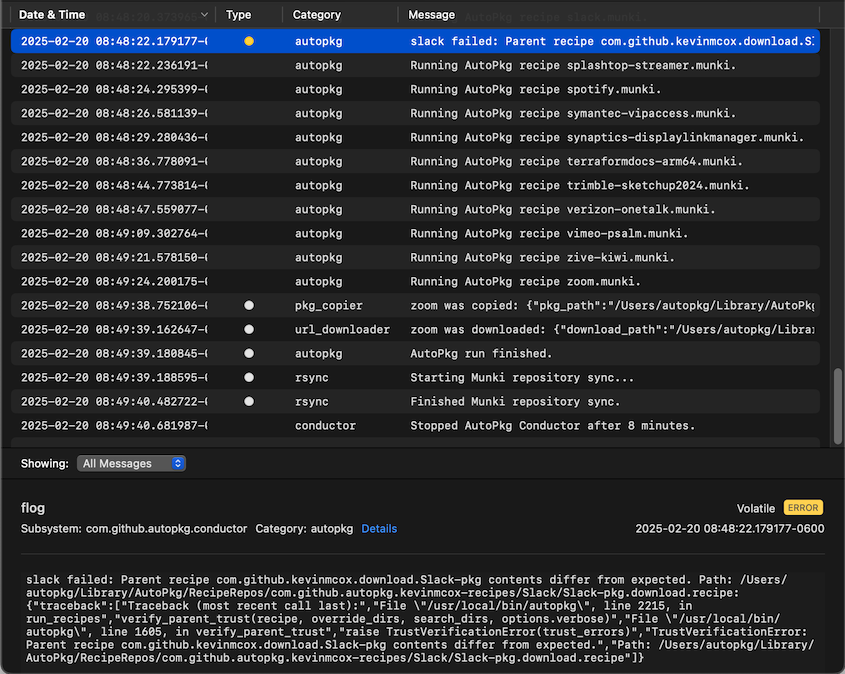
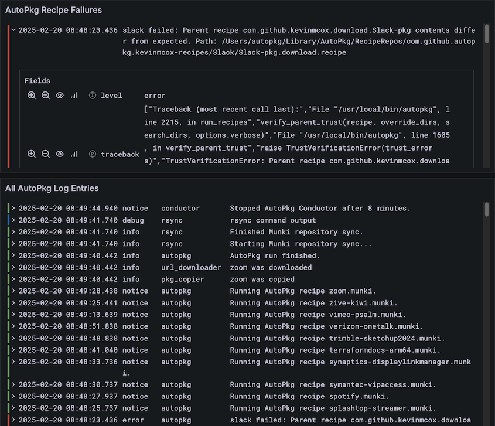

# AutoPkg Conductor and Logger

Based on https://github.com/rtrouton/autopkg-conductor/

This package executes AutoPkg for a list of Munki recipes, uploads new packages to the Munki web server, and logs the results to the macOS unified logging system.

_Disclaimer: This package is tailored for and dependent on Cirrus Partners’ environment, so a number of options from the original autopkg-conductor have been removed or replaced. That is to say, if you’re wanting to adopt a script for your own use, the original linked above is probably a better starting point, but we’re sharing this in case it’s helpful to anyone in the MacAdmins community._

The largest customization here is the logging. Conductor parses AutoPkg’s `report-plist` independently for each recipe and writes an opinionated* transcription to the macOS unified logging system. Some immediate highlights are logging each recipe as it’s run, varying log levels depending on the message, specifying the AutoPkg processor in the category field, and logging structured data that can easily be parsed.

This is how it appears in **Console.app**:



And this is in Grafana:



_*Our end goal was to get AutoPkg logs into Grafana, so some of the current message formatting is to make LogQL parsing easier. We’re currently writing the `log` output to disk and scraping with Alloy; eventually we’ll move to using the `unified_log` table in MacAdmins’ `osquery` extension which will not need as much manipulation in Loki._

## Dependencies

- `autopkg` https://github.com/autopkg/autopkg
- `flog` https://github.com/marcransome/flog
- `jq` (included in macOS 15)

## Assumptions

- Munki, AutoPkg, and this package are installed in their default paths
- AutoPkg is being used to feed Munki, not Jamf, Chocolatey, or something else
- The Munki web server is accessible from this device over `rsync`
- The local macOS user specified in `/Library/LaunchDaemons/com.github.autopkg.conductor.plist` has configured AutoPkg with at least `MUNKI_REPO`, `RECIPE_REPOS`, and `RECIPE_OVERRIDE_DIRS`
- The `recipes` AutoPkg repository is in `RECIPE_REPOS`
- The AutoPkg recipe overrides directory is part of a git repository
- There is an AutoPkg “recipe list” text file on this device

## Usage

Edit the following values in these files for your environment:

- `/Library/LaunchDaemons/com.github.autopkg.conductor.plist`
    - `StartInterval`: the number of seconds from the time Conductor stops until it starts up again
    - `UserName`
- `/Library/AutoPkg/conductor/autopkg.conductor.sh`
    - `recipe_list_path`
    - `remote_munki_repo`

Reload the Conductor LaunchDaemon:
```sh
sudo launchctl bootout system/com.github.autopkg.conductor
sudo launchctl bootstrap system /Library/LaunchDaemons/com.github.autopkg.conductor.plist
```

## Miscellaneous Notes

The `com.github.autopkg.conductor` LaunchDaemon writes STDOUT and STDERR from `autopkg.conductor.sh` to `/Library/Logs/com.github.autopkg/conductor_error.log`. This file _should_ be blank; it’s there to catch any unhandled output. Check this file along with the unified logging if there is unexpected behavior with Conductor.

(If you’re troubleshooting an AutoPkg recipe, use `autopkg run` directly with `-v` up to `-vvvv`. There’s also the `/private/var/log/autopkgserver` log if the issue is specific to packaging.)
